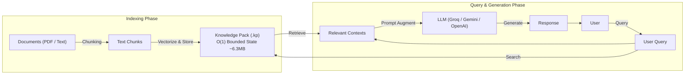
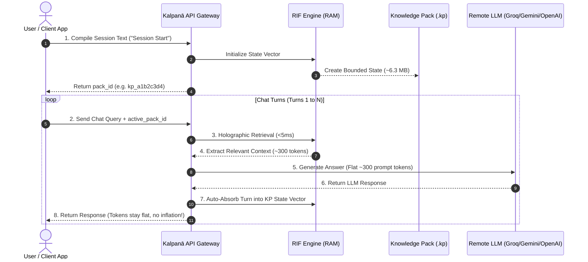
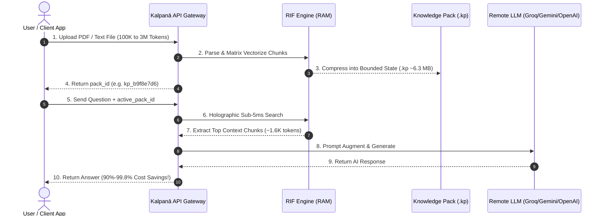

> [!IMPORTANT]
> ### 💰 Executive Business Impact: 90% to 99.8% LLM Bill Reduction
> **The Problem with Standard RAG & LLM Chat**: In traditional setups, a 100,000-token document or long customer conversation appends the entire uncompressed context on every query turn (100,000+ tokens per request), causing **LLM token bills and infrastructure costs to explode linearly $O(N)$**.
>
> **The Kalpanā RIF Solution**: Kalpanā RIF compresses enterprise documents and multi-turn chat sessions into a **bounded ~6.3 MB Knowledge Pack (`.kp`)**. Regardless of how massive the document or conversation grows (100,000 to 3,000,000+ tokens), **Kalpanā RIF only sends ~1,700 tokens max per query to the LLM**, delivering **90% to 99.8% direct cost savings** on your LLM API bill while running entirely on **cheap standard CPUs**!

---

## 🔗 Links & Official Documentation

- **Interactive OpenAPI Docs**: [https://madurox-kalpana-api-cpu.hf.space/docs](https://madurox-kalpana-api-cpu.hf.space/docs)

---

## 💥 Why Kalpanā RIF Beats Traditional RAG & Standard LLM Chat

Traditional RAG and standard chat applications suffer from **linear token inflation $O(N)$**, **high GPU server costs**, and **massive database storage footprints**. Kalpanā RIF (Recurrent Information Flow) solves these issues with **$O(1)$ Bounded Holographic Memory**:

| Feature / Metric | Standard Chat & Traditional RAG | Kalpanā RIF Engine |
|---|---|---|
| **Chat Memory Token Accumulation** | **Explodes Linearly $O(N)$** Every new turn appends all previous messages. By turn 30, prompt tokens inflate by 30x ($$$ bill). | **Flat Bounded $O(1)$ Memory** Every new turn auto-absorbs into a constant ~6.3 MB Knowledge Pack (`.kp`). Prompt tokens stay flat (~300 tokens) forever! |
| **3 Million Token Storage Footprint** | **5 GB – 15 GB Heavy Vector DBs** Requires Pinecone/Qdrant storing thousands of dense neural embedding vectors. | **Fixed ~6.3 MB `.kp` File** 3 Million tokens compress into a single bounded ~6.3 MB matrix file. |
| **Hardware Requirements** | **Requires Heavy GPUs** Needs GPU clusters to compute dense neural embeddings (`text-embedding-3`, `bge-large`). | **Runs on Lightweight CPUs** Matrix retrieval executes in **<5ms on standard cheap CPU servers**. |
| **Retrieval Speed & Latency** | 50ms – 300ms (Neural network embedding + ANN vector search) | **<5 ms** (CPU-native holographic sparse matrix dot product) |
| **Token Bill Cost Savings** | 0% (Pay for full document + full chat history every query) | **90% – 99.8% Cost Savings** |

---

## 🏗️ Architectural RAG Pipeline

The diagram below illustrates how Kalpanā AI indexes documents into a bounded **O(1) Knowledge Pack (`.kp`)**, retrieves relevant context in sub-5ms, and feeds augmented prompts to your registered LLM provider.

---

## 🔄 Sequence Diagrams for Core RIF Scenarios

### Sequence 1: Option 1 — $O(1)$ Bounded Conversation Memory (Chat History)

---

### Sequence 2: Option 2 — $O(1)$ Bounded Document Q&A (PDF / File Ingestion)

---

## 📌 Endpoint Reference

| Endpoint | Method | Purpose |
|---|---|---|
| `/health` | GET | Health check & system info |
| `/v1/models` | GET | List available LLM models |
| `/v1/providers` | GET | List known LLM providers |
| `/v1/providers/register` | POST | Register custom LLM provider (API key) |
| `/v1/providers/reset` | POST | Reset registered provider keys |
| `/v1/chat/completions` | POST | Chat with RIF context retrieval |
| `/v1/knowledge_packs/compile` | POST | Compile raw text → Knowledge Pack |
| `/v1/knowledge_packs/compile_file` | POST | Compile PDF/TXT file → Knowledge Pack |
| `/v1/knowledge_packs/upload` | POST | Import a .kp file |
| `/v1/knowledge_packs/{pack_id}/download` | GET | Download .kp file |
| `/v1/knowledge_packs` | GET | List active knowledge packs |
| `/v1/knowledge_packs/{pack_id}` | DELETE | Delete a knowledge pack |

---

## 🧪 Step-by-Step Testing Scenarios

### Option 1: O(1) Bounded Conversation Memory (Store Chat History with RIF)
1. Go to **🔌 LLM Providers** tab -> Register your API Key (**Groq**, **Google Gemini**, **OpenAI**, **Together**, **Cerebras**, **OpenRouter**).
2. Go to **📚 Knowledge Packs** tab -> **📝 Compile Text**.
3. Type `"Conversation Session Start"` and click **Compile into Knowledge Pack**.
4. Copy the generated `pack_id` (e.g. `kp_a1b2c3d4`).
5. Go to **💬 Chat Playground**, paste `pack_id` into **Active Pack ID**, and send chat messages.
6. Every chat turn is automatically absorbed into RIF memory state with constant $O(1)$ RAM usage — **no token accumulation**!

### Option 2: O(1) Bounded Document Q&A (PDF / Massive File Processing)
1. Go to **📚 Knowledge Packs** tab -> **📄 Compile File**.
2. Select a PDF/TXT document and click **📄 Compile File into .kp**.
3. Copy the generated `pack_id` (e.g. `kp_b9f8e7d6`).
4. Go to **💬 Chat Playground**, paste `pack_id` into **Active Pack ID**, and ask questions specific to your document!
5. Document context is compressed into constant $O(1)$ ~6.3 MB state with sub-5ms retrieval and **90%+ cost savings**!

---

## 📄 License

MIT
