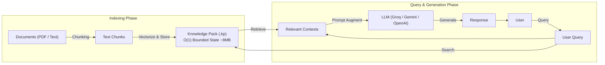

# 🧠 Kalpanā AI — LLM API Testing Interface & Architectural Guide

A premium, dark-themed single-page web application for interactively testing all endpoints of the **Kalpanā AI RIF Engine API**.

---

## 🔗 Links & Official Documentation

- **Interactive OpenAPI Docs**: [https://madurox-kalpana-api-cpu.hf.space/docs](https://madurox-kalpana-api-cpu.hf.space/docs)

---

## 🏗️ Architectural RAG Pipeline

The diagram below illustrates how Kalpanā AI indexes documents into a bounded **O(1) Knowledge Pack (`.kp`)**, retrieves relevant context in sub-5ms, and feeds augmented prompts to your registered LLM provider.

---

## 📌 Endpoint Reference

| Endpoint | Method | Purpose |
|---|---|---|
| `/health` | GET | Health check & system info |
| `/v1/models` | GET | List available LLM models |
| `/v1/providers` | GET | List known LLM providers |
| `/v1/providers/register` | POST | Register custom LLM provider (API key) |
| `/v1/providers/reset` | POST | Reset registered provider keys |
| `/v1/chat/completions` | POST | Chat with RIF context retrieval |
| `/v1/knowledge_packs/compile` | POST | Compile raw text → Knowledge Pack |
| `/v1/knowledge_packs/compile_file` | POST | Compile PDF/TXT file → Knowledge Pack |
| `/v1/knowledge_packs/upload` | POST | Import a .kp file |
| `/v1/knowledge_packs/{pack_id}/download` | GET | Download .kp file |
| `/v1/knowledge_packs` | GET | List active knowledge packs |
| `/v1/knowledge_packs/{pack_id}` | DELETE | Delete a knowledge pack |

---

## 🧪 Step-by-Step Testing Scenarios

### Scenario 1: General Stateless Query (No Document Attached)
1. Go to **🔌 LLM Providers** tab.
2. Select your provider (**Groq**, **Google Gemini**, **OpenAI**, **Together**, **Cerebras**, **OpenRouter**).
3. Enter your API Key and click **🔌 Register Provider**.
4. Switch to **💬 Chat Playground**, leave `Active Pack ID` blank, and type your question (e.g. *"What is quantum computing?"*).

### Scenario 2: O(1) Bounded Conversation Memory (Store Chat with RIF)
1. Go to **📚 Knowledge Packs** tab -> **📝 Compile Text**.
2. Type `"Conversation Session Start"` and click **Compile into Knowledge Pack**.
3. Copy the generated `pack_id` (e.g. `kp_a1b2c3d4`).
4. Go to **💬 Chat Playground**, paste `pack_id` into **Active Pack ID**, and send chat messages.
5. Every chat turn is automatically absorbed into RIF memory state with constant $O(1)$ RAM usage!

### Scenario 3: Document-Based Q&A (PDF / Knowledge Pack Attached)
1. Go to **📚 Knowledge Packs** tab -> **📄 Compile File**.
2. Select a PDF/TXT document and click **📄 Compile File into .kp**.
3. Copy the generated `pack_id` (e.g. `kp_b9f8e7d6`).
4. Go to **💬 Chat Playground**, paste `pack_id` into **Active Pack ID**, and ask questions specific to your document!

---

## 📄 License

MIT
